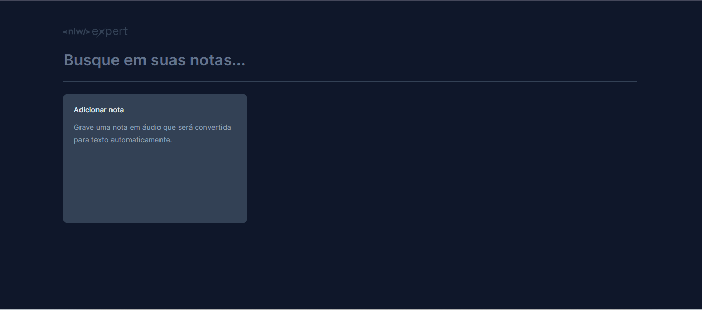
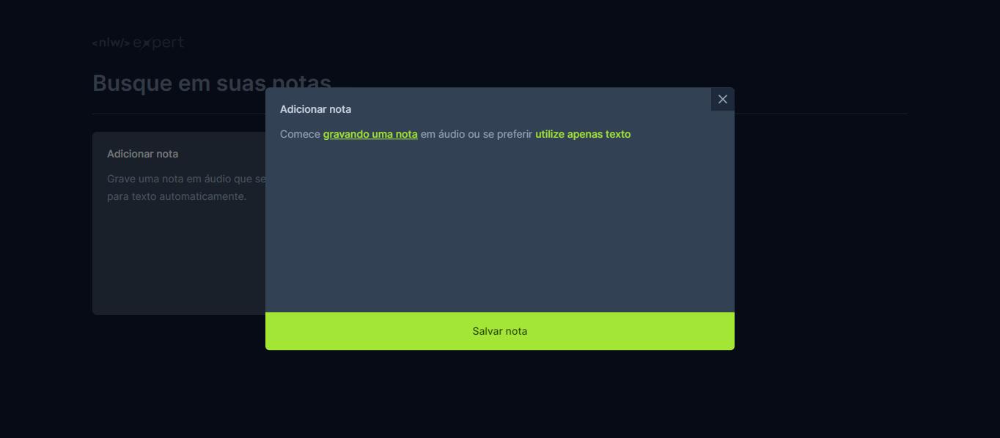

# Notes

<div align="center">
    
    
</div>

## 💻 Projeto

Este projeto foi desenvolvido na NLW Expert da Rocketseat na trilha de ReactJS. É uma aplicação de Notas que permite gravar uma nota utilizando o reconhecimento de voz utilizando APIs do navegador.

## 🧪 Tecnologias

Esse projeto foi desenvolvido com as seguintes tecnologias:

- [Reactjs](https://reactjs.org)
- [Tailwind](https://tailwindcss.com/)
- [Radix UI](https://www.radix-ui.com/)
- [Typescript](https://www.typescriptlang.org/)
- [SpeechRecognition](https://developer.mozilla.org/en-US/docs/Web/API/SpeechRecognition)

## 🚀 Como executar

Clone o projeto e acesse a pasta do mesmo.

```bash
$ git clone https://github.com/Futila/notes.git
$ cd notes
```

Para iniciá-lo, siga os passos abaixo:

```bash
# Instalar as dependências
$ npm install

# Iniciar o projeto
$ npm run dev
```

## Meta

Author - Rockeseat.

programmer - [Fernando Futila] - fernando.futila@gmail.com

---

Feito com 💜 by Fernando Futila 👋🏻
